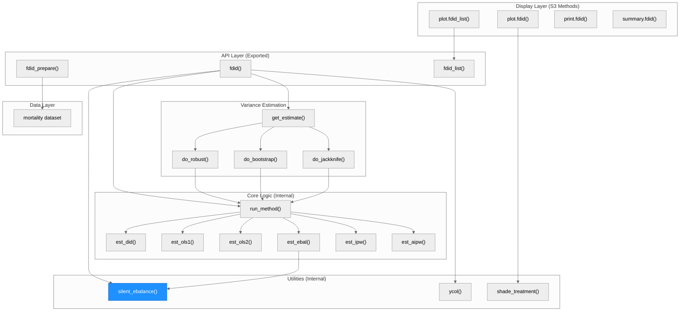
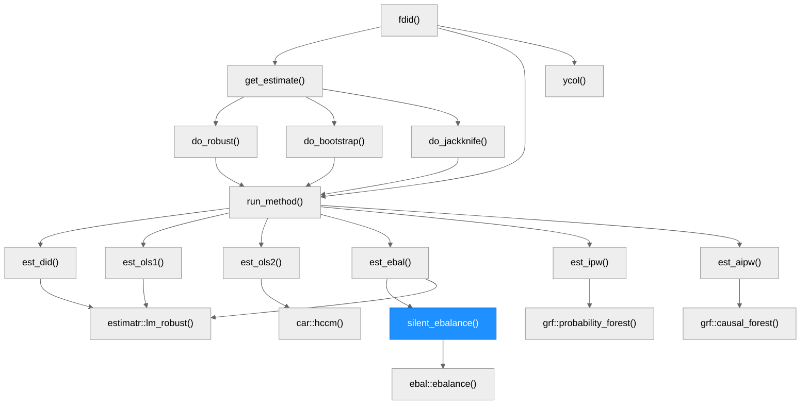
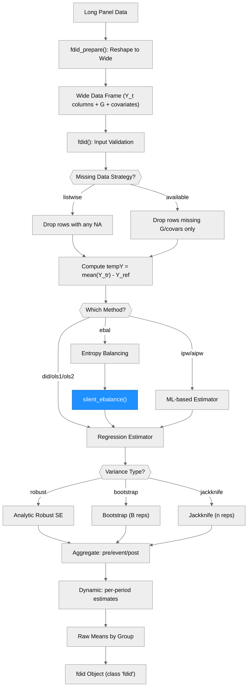

# Architecture — fdid

> Generated by scribe for run `CRAN-fix-warn-001` on 2026-03-18.

## Overview

`fdid` is an R package implementing the Factorial Difference-in-Differences (FDID) framework for panel data settings where all units are exposed to a universal event but vary in a baseline factor G. The package provides six estimation methods (OLS1, OLS2, DID, entropy balancing, IPW, AIPW), three variance estimators (robust, bootstrap, jackknife), and supports dynamic, aggregate, and raw-means output with plotting and summary methods. Key external dependencies include `estimatr` (robust regression), `ebal` (entropy balancing), `grf` (causal forests for IPW/AIPW), and `dplyr`/`tidyr` (data wrangling).

---

## Module Structure

> One unified diagram. Blue fill = modified in this run (`silent_ebalance` was the only function changed).

### Module Reference

| Module / File | Layer | Purpose | Key Exports | Changed |
| --- | --- | --- | --- | --- |
| `R/fdid.R` | API + Core + Variance + Utils | Main estimation function with all internal subroutines | `fdid()` | **yes** |
| `R/fdid_prepare.R` | API | Reshape long data to wide format for FDID analysis | `fdid_prepare()` | no |
| `R/fdid_list.R` | API | Bundle multiple `fdid` objects into a list class | `fdid_list()` | no |
| `R/plot.R` | Display | Plot raw means, dynamic effects, propensity overlap | `plot.fdid()` | no |
| `R/plot.fdid_list.R` | Display | Comparison plot of multiple FDID estimates | `plot.fdid_list()` | no |
| `R/print.R` | Display | Brief overview print method | `print.fdid()` | no |
| `R/summary.R` | Display | Formatted aggregate + dynamic estimates summary | `summary.fdid()` | no |
| `R/data.r` | Data | Documentation for the `mortality` example dataset | `mortality` | no |
| `R/package.R` | Utils | Package-level imports (grDevices, graphics, stats, etc.) | *(none)* | no |

---

## Function Call Graph

> Blue node = changed in this run. `silent_ebalance()` had its warning suppression mechanism replaced.

### Function Reference

| Function | Defined In | Called By | Calls | Changed | Purpose |
| --- | --- | --- | --- | --- | --- |
| `fdid()` | `R/fdid.R` | user / exported | `get_estimate`, `run_method`, `ycol`, `silent_ebalance` | no | Main FDID estimation entry point |
| `fdid_prepare()` | `R/fdid_prepare.R` | user / exported | dplyr/tidyr ops | no | Reshape long panel data to wide format |
| `fdid_list()` | `R/fdid_list.R` | user / exported | *(none)* | no | Bundle multiple fdid objects |
| `get_estimate()` | `R/fdid.R` | `fdid` | `do_robust`, `do_bootstrap`, `do_jackknife` | no | Variance-type dispatcher |
| `run_method()` | `R/fdid.R` | `get_estimate`, variance wrappers | `est_did` .. `est_aipw` | no | Estimation method dispatcher |
| `est_did()` | `R/fdid.R` | `run_method` | `estimatr::lm_robust` | no | Simple DID estimator |
| `est_ols1()` | `R/fdid.R` | `run_method` | `estimatr::lm_robust` | no | OLS with covariates (no interactions) |
| `est_ols2()` | `R/fdid.R` | `run_method` | `lm`, `car::hccm`, `sandwich::vcovCL` | no | OLS with interactions + Lin correction |
| `est_ebal()` | `R/fdid.R` | `run_method` | `silent_ebalance`, `estimatr::lm_robust` | no | Entropy balancing estimator |
| `est_ipw()` | `R/fdid.R` | `run_method` | `grf::probability_forest`, `estimatr::lm_robust` | no | Inverse probability weighting |
| `est_aipw()` | `R/fdid.R` | `run_method` | `grf::causal_forest` | no | Augmented IPW via causal forest |
| `silent_ebalance()` | `R/fdid.R` | `est_ebal` | `ebal::ebalance` (wrapped in `suppressWarnings`) | **yes** | Suppress console output and warnings from ebal |
| `do_robust()` | `R/fdid.R` | `get_estimate` | `run_method` | no | Pass-through for robust SE |
| `do_bootstrap()` | `R/fdid.R` | `get_estimate` | `run_method` (B times) | no | Bootstrap variance estimation |
| `do_jackknife()` | `R/fdid.R` | `get_estimate` | `run_method` (n times) | no | Jackknife variance estimation |
| `ycol()` | `R/fdid.R` | `fdid` | *(none)* | no | Convert numeric time to Y_-prefixed column name |
| `plot.fdid()` | `R/plot.R` | user / S3 | `shade_treatment` | no | Plot raw means, dynamic effects, or overlap |
| `plot.fdid_list()` | `R/plot.fdid_list.R` | user / S3 | *(none)* | no | Comparison forest plot |
| `print.fdid()` | `R/print.R` | user / S3 | *(none)* | no | Brief fdid overview |
| `summary.fdid()` | `R/summary.R` | user / S3 | *(none)* | no | Formatted summary of all estimates |

---

## Data Flow

> Vertical flowchart. Blue = changed in this run.

---

## Architectural Patterns

- **Monolithic single-file core**: All estimation logic, variance wrappers, and internal helpers are defined as closures inside `fdid()` in `R/fdid.R`. This gives them access to the parent environment (e.g., `nsims`, `parallel`, `cores`, `covar`) without explicit parameter passing.
- **Dispatcher pattern**: `run_method()` and `get_estimate()` act as dispatchers that route to the correct estimation and variance functions based on string arguments.
- **S3 class system**: The `fdid` class uses standard R S3 methods (`print`, `summary`, `plot`) for user-facing display.
- **Parallel backend abstraction**: Bootstrap and jackknife variance support three backends: sequential, `mclapply` (Unix fork), and `foreach`/`doFuture` (Windows/cross-platform), selected automatically based on platform.
- **Console suppression via sink**: `silent_ebalance()` redirects stdout/stderr to a temp file via `sink()` to suppress chatty output from `ebal::ebalance()`, orthogonal to the warning suppression now handled by `suppressWarnings()`.

---

## Notes

- The `silent_ebalance()` function previously used `options(warn = -1)` to suppress warnings globally. This was replaced with `suppressWarnings()` to comply with CRAN policy. The sink-based console output suppression remains unchanged.
- All estimation subroutines are closures inside `fdid()`, so they are not independently testable. Testing goes through the `fdid()` entry point.
- The package has no compiled code (`NeedsCompilation: no`).
